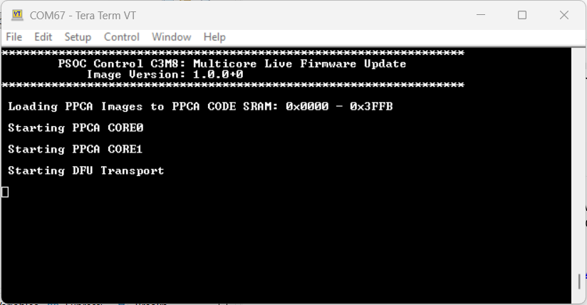
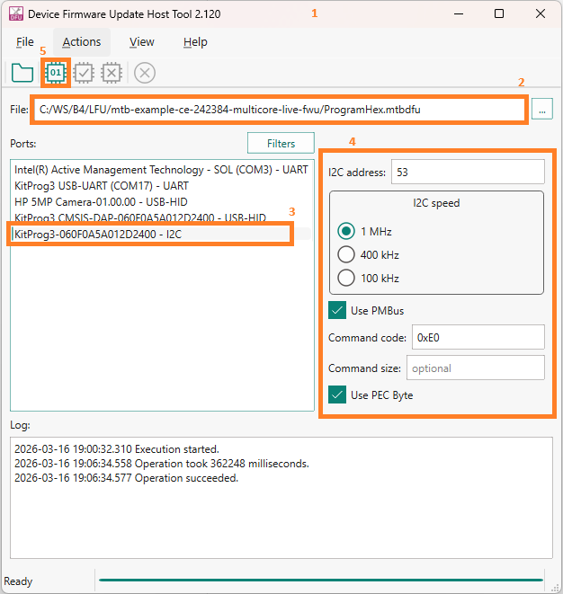
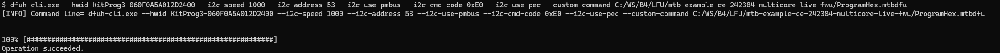
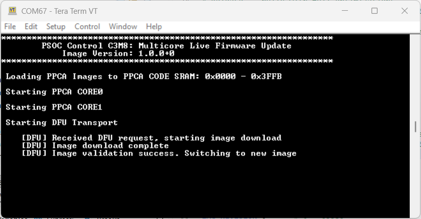
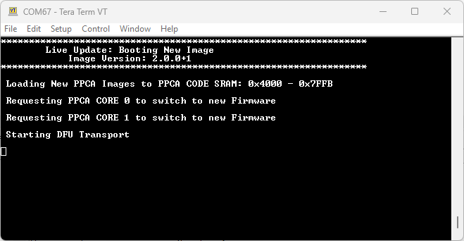
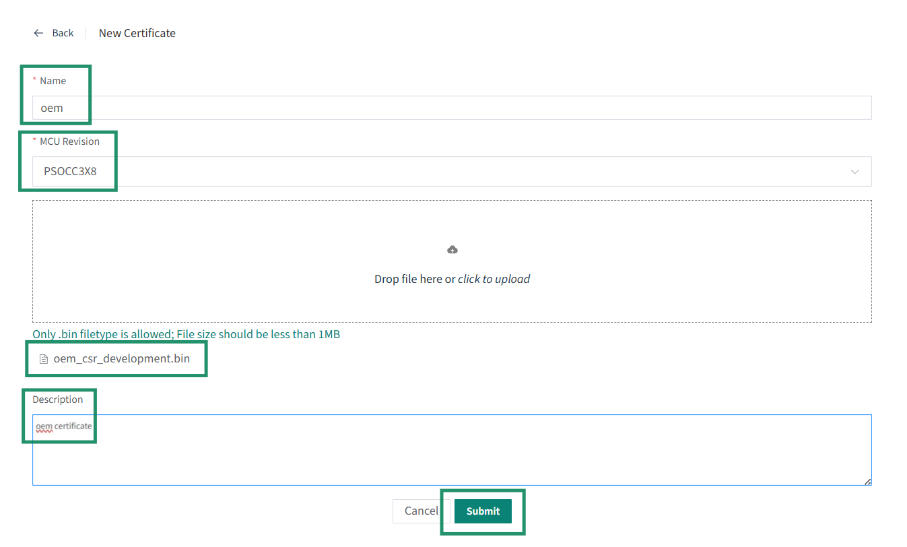

# PSOC&trade; Control C3M/P8 MCU: Multicore live firmware update

This code example applies for PSOC&trade; Control C3M/P8 MCUs. This code example demonstrates how to perform a multicore firmware update without a device reset by leveraging the dual bank feature of the PSOC&trade; Control C3M8 MCU flash. The code example utilize Infineon's Device Firmware Update (DFU) middleware (MW) for downloading the image.

See the [Design and implementation](docs/design_and_implementation.md) for the functional description of this example.

[View this README on GitHub.](https://github.com/Infineon/mtb-example-ce242384-multicore-live-fwu)

[Provide feedback on this code example.](https://yourvoice.infineon.com/jfe/form/SV_1NTns53sK2yiljn?Q_EED=eyJVbmlxdWUgRG9jIElkIjoiQ0UyNDIzODQiLCJTcGVjIE51bWJlciI6IjAwMi00MjM4NCIsIkRvYyBUaXRsZSI6IlBTT0MmdHJhZGU7IENvbnRyb2wgQzNNL1A4IE1DVTogTXVsdGljb3JlIGxpdmUgZmlybXdhcmUgdXBkYXRlIiwicmlkIjoidmluYXkucmFuZ2Fzd2FteUBpbmZpbmVvbi5jb20iLCJEb2MgdmVyc2lvbiI6IjEuMC4wIiwiRG9jIExhbmd1YWdlIjoiRW5nbGlzaCIsIkRvYyBEaXZpc2lvbiI6Ik1DRCIsIkRvYyBCVSI6IklDVyIsIkRvYyBGYW1pbHkiOiJQU09DIn0=)

## Requirements

- [ModusToolbox&trade;](https://www.infineon.com/modustoolbox) v3.9.0 or later (tested with v3.9.0)
- Board support package (BSP) minimum required version for:
   - KIT_PSC3M8_EVK: v2.2.0
- Programming language: C
- Associated parts: All [PSOC&trade; Control C3 MCU](https://www.infineon.com/products/microcontroller/32-bit-psoc-arm-cortex/32-bit-psoc-control-arm-cortex-m33-mcu/psoc-control-c3-performance-line) parts


## Supported toolchains (make variable 'TOOLCHAIN')

- GNU Arm&reg; Embedded Compiler v14.2.1 (`GCC_ARM`) – Default value of `TOOLCHAIN`
- Arm&reg; Compiler v6.22 (`ARM`)
- IAR C/C++ Compiler v9.70.4 (`IAR`)


## Supported kits (make variable 'TARGET')

- [PSOC&trade; Control C3M8 Evaluation Kit](https://www.infineon.com/KIT_PSC3M8_EVK) (`KIT_PSC3M8_EVK`) – Default value of `TARGET`


## Hardware setup

This example uses the board's default configuration. See the kit user guide to ensure that the board is configured correctly.


## Software setup

See the [ModusToolbox&trade; tools package installation guide](https://www.infineon.com/ModusToolboxInstallguide) for information about installing and configuring the tools package.

<details><summary><b>ModusToolbox&trade; Edge Protect Security Suite </b></summary>

1. Download and install the [Infineon Developer Center Launcher](https://www.infineon.com/cms/en/design-support/tools/utilities/infineon-developer-center-idc-launcher)

2. Login using your Infineon credentials

3. Download and install the “ModusToolbox&trade; Edge Protect Security Suite” from Developer Center Launcher

    > **Note:** The default installation directory of the Edge Protect Security Suite in Windows operating system is *C:/Users/`<USER>`/Infineon/Tools*

4. After installing the Edge Protect Security Suite, add the Edge Protect tools executable to the system PATH variable

   Edge Protect tools executable is located in *<Edge-Protect-Security-Suite-install-path>/ModusToolbox-Edge-Protect-Security-Suite-`<version>`/tools/edgeprotecttools/bin*

</details>

<details><summary><b>ModusToolbox&trade; PMBus Configurator </b></summary>

1. Login to the Developer Center Launcher using your Infineon credentials

2. Download and install the “ModusToolbox&trade; PMBus Configurator” from Developer Center Launcher

    > **Note:** The default installation directory of the PMBus Configurator in Windows operating system is *C:/Users/`<USER>`/Infineon/Tools*

</details>

Install a terminal emulator if you do not have one. Instructions in this document use [Tera Term](https://teratermproject.github.io/index-en.html).

Install Python if not installed already – download from [Python.org](https://www.python.org/downloads/).

This example requires no additional software or tools.


## Operation

See [Using the code example](docs/using_the_code_example.md) for instructions on creating a project, opening it in various supported IDEs, and performing tasks, such as building, programming, and debugging the application within the respective IDEs.

1. Connect the board to your PC using the provided USB cable through the KitProg3 USB connector

2. Open a terminal program and select the KitProg3 COM port. Set the serial port parameters to 8N1 and 115200 baud

3. Provision the device to enable the dual-bank feature by following the steps to [enable dual-bank feature](#enable-dual-bank-feature)

4. Build and Program the image to the device. After Programming, the application starts automatically. Confirm "PSOC Control C3M8: Multicore Live Firmware Update" is displayed on the UART terminal along with the version "Image Version : 1.0.0+0"

    **Figure 1. Terminal output on program startup**

    

5. Confirm that PPCA cores are started by checking whether User LED 3 (D10) (by Main CPU), user LED 2 (D9) (by PPCA0) and user LED 6 (D13) (by PPCA1) are blinking at approximately 1000 ms Main CPU and has started the DFU transport for receiving an update image. Verify that PPCA CPUs output PWM waveform on pin P8.0 and pin P8.2.

6. Build an update image to be transferred to the device to perform live firmware update

    1. Open the file *`<app-directory>`/common.mk* and change `IMAGE_TYPE` to `UPDATE`. This change is required to relocate the image to the alternate bank

    2. Change the image version and build number fields

        ```
        IMG_VER_MAJOR=2
        IMG_VER_MINOR=0
        IMG_REVISION=0
        IMG_BUILD_NO=1
        ```

        > **Note:** `IMG_BUILD_NO` serves two purposes:
        >  1. Decides the active region for the PPCA application. For successful live firmware update, build number should be odd if it was even in the previous build and vise versa
        >  2. Build number also acts as a dual-bank counter that is used by BootROM to decide the flash bank mapping during normal bootup. For BootROM to boot the latest or last updated image, build number should be greater than the previos image build number

    3. Clean build the project to generate the update image

        > **Note:** Do not program this image using KitProg3

7. Download the update image to the device to perform the live firmware update

    1. The *mdbdfu* file with the appropriate command sequence to transfer the update image is provided in *`<app-directory>`/ProgramHex.mtbdfu*. Open the file and update the `dataFile` field in the "commands" section with the absolute path of the project hex file *`<app-directory>`/build/app_combined.hex*

    2. Download the firmware using either the DFU Host Tool GUI or CLI

        <details><summary><b>Using DFU Host Tool GUI</b></summary>

        1. Open *dfuh-tool.exe* located at *\<install-path>/ModusToolbox/tools_x.y/dfuh-tool*
        2. Select *`<app-directory>`/ProgramHex.mtbdfu* as the input file to DFU Host Tool
        3. Select the I2C interface
        4. Configure the I2C interface parameters for PMBus usage as shown in **Figure 2**
        5. Click on *Execute* button to start the image download

            **Figure 2. DFU Host Tool GUI**

            

        </details>

        <details><summary><b>Using DFU Host Tool CLI</b></summary>

        1. Open the modus-shell terminal and move to DFU Host Tool directory (*[install-path]/ModusToolbox/tools_x.y/dfuh-tool*)

        2. Execute the following DFU CLI command from the Host Tool directory in the shell terminal:

            ```
            dfuh-cli.exe --custom-command path-to-mtbdfu-file --hwid Probe-id/COM Port  --interface-params 
            ```

            For example, to use PMBus interface, use:

            ```
            dfuh-cli.exe --hwid KitProg3-<Probe ID> --i2c-speed 1000 --i2c-address 53 --i2c-use-pmbus --i2c-cmd-code 0xE0 --i2c-use-pec --custom-command `<app-directory>`/ProgramHex.mtbdfu
            ```

            **Figure 3. Console output of DFU Host Tool CLI**

            

        </details>

        > **Note:** See [DFU Host Tool for ModusToolbox&trade; User Guide](https://www.infineon.com/ModusToolboxDFUHostTool) for more details on each of the interfaces

8. The device receives the update image and stages it in the alternate bank, validates it and triggers the live firmware update process by changing the flash bank mapping and directly jumping to the new image

    **Figure 4. Terminal output of image download**

    

9. Confirm that the main CM33 core is running the new image – "Live Update: Booting New Image" is displayed on the UART terminal along with the version "Image Version : 2.0.0+1". Main CM33 core app detects the status of PPCA cores and requests the PPCA cores to switch to the new app

    **Figure 5. Terminal output of updated image**

    

10. Confirm that the PPCA cores switch to the new app by checking logs. Confirm all the LEDs continue to blink at 1000 ms and the DFU transport has started for receiving an update image. Verify that the PWM waveform is glitch free during and after firmware update 

    > **Note:** To perform another live firmware update, repeat the process from Step 6. Just ensure that build number is set properly
    >
    > The build number is a 32-bit dual-bank counter and must be provided as a **decimal integer** (the signing tool does not accept a hex value). The upper 16 bits must equal the magic value `0x5A3C` and the lower 16 bits hold the actual build number, so the value must always be `0x5A3C0000 + <build-number>`. This example uses `2.0.0+1513881601`, where `1513881601` = `0x5A3C0001` (magic `0x5A3C`, build number `1`). To increment, add `1` (which increments only the lower 16 bits), for example `1513881602` (`0x5A3C0002`), keeping the `0x5A3C` magic intact


11. You can reset the device and check that the BootROM is booting the latest image "Image Version : 2.0.0+1" and PPCA cores are running the latest app as well.

12. To restore the device to its default configuration for executing other code examples with dual bank feature disabled, follow the steps mentioned in [Steps to restore the device (Disable Dual bank feature)](#steps-to-restore-the-device-disable-dual-bank-feature)


### Enable dual-bank feature

#### Prerequisite

Infineon’s Edge Protect Tools is a set of command line tools used to perform the functions needed for key signing, key generation, OEM certificate creation, device provisioning, and so on. These tools are executed through a shell tool. **Edge Protect Tools** executable is made available in the *C:/Users/<user>/Infineon/Tools/ModusToolbox-Edge-Protect-Security-Suite-x.y.z/tools/edgeprotecttools/bin* directory.

Add the executable path to the system environment path variable of the host PC.

To use Edge Protect Tools CLI, is recommended to use "modus-shell", installed along with ModusToolbox&trade; located in the *ModusToolbox/tools_x.y* directory. 


#### Ownership transfer

Before changing the policy file, transfer the device ownership to yourself using these steps:

1. Open modus-shell and navigate to the application directory

    ```
    cd <app-directory>

    ```

2. Execute the following command to initialize the tools. This is required once after the new version of EAP is installed

    ```
    edgeprotecttools -t psoc_c3x8 init
    ```

3. Execute the following command to configure the openOCD tools path:

    ```
    edgeprotecttools set-ocd --name openocd --path <openocd_path>
    ```

    > **Note:** Replace <openocd_path> with the path to the openocd directory. Typically, this will be *C:/infineon/Tools/ModusToolboxProgtools-x.y/openocd*

4. Create a private and public key pair. The following command generates one pair of keys that is placed in the keys directory:

    ```
    edgeprotecttools --no-interactive-mode create-key --key-type ECDSA-P521 -o keys/oem_dev_priv_key.pem keys/oem_dev_pub_key.pem
    ```

5. To generate a new CSR, execute this command:

    ```
    edgeprotecttools -t psoc_c3x8 oem-csr --public-key-0 keys/oem_dev_pub_key.pem --public-key-1 keys/oem_dev_pub_key.pem --sign-key-0 keys/oem_dev_priv_key.pem --sign-key-1 keys/oem_dev_priv_key.pem --oem "Company Name" --project "Project Name" --project-number 12345678 --cert-type development --output oem_csr_development.bin
    ```

6. Once the CSR is created, it must be signed by Infineon to create a valid OEM certificate. Follow these steps outlined to generate an Infineon signed OEM certificate.

      1. Prior to creating a certificate, you must sign up for an Infineon online software tools and services (OSTS) account. Any developer may create an OSTS account by registering at [osts.infineon.com](https://osts.infineon.com/epss/home)

      2. Once you have registered, login to your OSTS account and click on **Edge Protect Signing Service**. This will take you to a page where you can upload your Certificate Signing Request (CSR) that you created in the previous step. Click on the **Upload New Certificate Request** button. This will take you to a window where you can upload your CSR, enter a name for the certificate, and enter a description

         **Figure 6 Upload new certificate request**

         
     
      3. Enter the certificate name without any spaces or special characters, if you enter the name as “oem”, the generated certificate will be named “oem_cert.bin”. Select the silicon revision as **PSOCC3X8**. Next, enter the description for this certificate in the “Description” field. This description will be in the list of certs that you own, so you can easily identify one cert from another if you have more than one.

      4. Click the **Drop file here or click to upload button** to upload the CSR and navigate to the CSR that you created in the previous step instead of dropping the file in this area. In the previous steps, the path was *`<app-directory>`/keys/oem_csr_developement.bin*
         
         **Figure 7 Uploading CSR**

         

      5. Once the name and description have been entered and the CSR has been uploaded, click the **Submit** button. This should take you back to the original page with a list of certificates under **Manage Certificates**. If the list does not show the most recent certificate generated, click on the **Refresh List**. You should now see the signed certificate ready for you to download. Click on the **Download** button on the line that contains the certificate you want to download. This will download the signed certificate to the location on your computer where the files are downloaded.

         **Figure 8 Manage certificates**

         

      > **Note:** You can revisit this website at any time and download any of the certificates that have been signed in the past. During development, you only need to perform these steps once, but you can generate multiple certificates if needed.


7. Place the certificate obtained in the *`<app-directory>`/keys/* folder as *oem_cert_development.bin*. Provision the device with the key and certificate to transfer the ownserhip

    ```
    edgeprotecttools -t psoc_c3x8 provision-device -p policy/policy_oem_provisioning.json --ifx-oem-cert keys/oem_cert_development.bin --key keys/oem_dev_priv_key.pem
    ```


#### Provision the device

To enable dual-bank in the PSOC&trade; Control device, update the necessary fields in the OEM policy and provision the device with the updated policy file. 

The OEM policy file (*policy_oem_provisioning.json*) is located in the *[application directory]/policy/* directory, which is created when `edgeprotecttools` is initialized.

1. In the OEM policy, set the following fields:

   - `device_policy` > `boot` > `boot_cfg_id` > `value` to `DUAL_BANK_SIMPLE_APP`
   - `device_policy` > `boot` > `boot_bank_ctr_offset` > `value` to `0x00000018`

    ```
    "boot": {
      "boot_cfg_id": {
        "description": "A behavior for BOOT_APP_LAYOUT (BOOT_SIMPLE_APP applicable to NORMAL_PROVISIONED only)",
        "applicable_conf": "SIMPLE_APP, SECURE_APP, DUAL_BANK_SIMPLE_APP, DUAL_BANK_SECURE_APP, PROT_FW",
        "value": "DUAL_BANK_SIMPLE_APP"
      },
      "boot_bank_ctr_offset": {
        "description": "An offset from the start of each flash bank where a 32-bit counter for flash dual bank switching is placed",
        "value": "0x00000018"
      },

    ```

2. In the OEM policy, update the `device_policy` > `boot` > `boot_app_layout` field as shown below

    ```
      "boot_app_layout": {
        "description": "The memory layout for the applications defined by BOOT_CFG_ID. 0x32000000 - 0x33FFFFFF for secure addresses; 0x22000000 - 0x23FFFFFF for non-secure addresses",
        "value": [
          {
            "address": "0x32000400",
            "size": "0x40000"
          },
          {
            "address": "0x00000000",
            "size": "0x00"
          },
          {
            "address": "0x00000000",
            "size": "0x00"
          },
          {
            "address": "0x00000000",
            "size": "0x00"
          },
          {
            "address": "0x00000000",
            "size": "0x00"
          }
        ]
      },
    ```

3. Once the policy is updated, provision the device with the updated policy

    ```
    edgeprotecttools -t psoc_c3x8 provision-device -p policy/policy_oem_provisioning.json --ifx-oem-cert keys/oem_cert_development.bin --key keys/oem_dev_priv_key.pem
    ```


### Steps to restore the device (Disable Dual bank feature)

Revert the changes to policy file (*policy_oem_provisioning.json*) and reprovision the device.

1. In the OEM policy, set the following fields:

   - `device_policy` > `boot` > `boot_cfg_id` > `value` to `SIMPLE_APP`

    ```
    "boot": {
      "boot_cfg_id": {
        "description": "A behavior for BOOT_APP_LAYOUT (BOOT_SIMPLE_APP applicable to NORMAL_PROVISIONED only)",
        "applicable_conf": "SIMPLE_APP, SECURE_APP, DUAL_BANK_SIMPLE_APP, DUAL_BANK_SECURE_APP, PROT_FW",
        "value": "SIMPLE_APP"
      },
    ```

2. In the OEM policy, update the `device_policy` > `boot` > `boot_app_layout` field as shown below.

    ```
      "boot_app_layout": {
        "description": "The memory layout for the applications defined by BOOT_CFG_ID. 0x32000000 - 0x33FFFFFF for secure addresses; 0x22000000 - 0x23FFFFFF for non-secure addresses",
        "value": [
          {
            "address": "0x32000000",
            "size": "0x40000"
          },
          {
            "address": "0x00000000",
            "size": "0x00"
          },
          {
            "address": "0x00000000",
            "size": "0x00"
          },
          {
            "address": "0x00000000",
            "size": "0x00"
          },
          {
            "address": "0x00000000",
            "size": "0x00"
          }
        ]
      },
    ```

3. Once the policy changes are reverted, provision the device.

    ```
    edgeprotecttools -t psoc_c3x8 provision-device -p policy/policy_oem_provisioning.json --ifx-oem-cert keys/oem_cert_development.bin --key keys/oem_dev_priv_key.pem
    ```


## Related resources

Resources  | Links
-----------|----------------------------------
Code examples  | [Using ModusToolbox&trade;](https://github.com/Infineon/Code-Examples-for-ModusToolbox-Software) on GitHub
Device documentation | [PSOC&trade; Control C3M/P8 MCU documents](https://www.infineon.com/products/microcontroller/32-bit-psoc-arm-cortex/32-bit-psoc-control-arm-cortex-m33-mcu/psoc-control-c3-performance-line?ftab=01#Documents)
Development kits | Select your kits from the [Evaluation board finder](https://www.infineon.com/cms/en/design-support/finder-selection-tools/product-finder/evaluation-board)
Libraries on GitHub  | [mtb-dsl-psc3m8](https://github.com/Infineon/mtb-dsl-psc3m8) – Device Support Library (DSL) <br> [retarget-io](https://github.com/Infineon/retarget-io) – Utility library to retarget STDIO messages to a UART port
Tools  | [ModusToolbox&trade;](https://www.infineon.com/modustoolbox) – ModusToolbox&trade; software is a collection of easy-to-use libraries and tools enabling rapid development with Infineon MCUs for applications ranging from wireless and cloud-connected systems, edge AI/ML, embedded sense and control, to wired USB connectivity using PSOC&trade; Industrial/IoT MCUs, AIROC&trade; Wi-Fi and Bluetooth&reg; connectivity devices, XMC&trade; Industrial MCUs, and EZ-USB&trade;/EZ-PD&trade; wired connectivity controllers. ModusToolbox&trade; incorporates a comprehensive set of BSPs, HAL, libraries, configuration tools, and provides support for industry-standard IDEs to fast-track your embedded application development

<br>


## Other resources

Infineon provides a wealth of data at [www.infineon.com](https://www.infineon.com) to help you select the right device, and quickly and effectively integrate it into your design.


## Document history

Document title: *CE242384* – *PSOC&trade; Control C3M/P8 MCU: Multicore live firmware update*

 Version | Description of change
 ------- | ---------------------
 1.0.0   | New code example
<br>


All referenced product or service names and trademarks are the property of their respective owners.

The Bluetooth&reg; word mark and logos are registered trademarks owned by Bluetooth SIG, Inc., and any use of such marks by Infineon is under license.

PSOC&trade;, formerly known as PSoC&trade;, is a trademark of Infineon Technologies. Any references to PSoC&trade; in this document or others shall be deemed to refer to PSOC&trade;.

---------------------------------------------------------

(c) 2026, Infineon Technologies AG, or an affiliate of Infineon Technologies AG. All rights reserved.
This software, associated documentation and materials ("Software") is owned by Infineon Technologies AG or one of its affiliates ("Infineon") and is protected by and subject to worldwide patent protection, worldwide copyright laws, and international treaty provisions. Therefore, you may use this Software only as provided in the license agreement accompanying the software package from which you obtained this Software. If no license agreement applies, then any use, reproduction, modification, translation, or compilation of this Software is prohibited without the express written permission of Infineon.
<br>
Disclaimer: UNLESS OTHERWISE EXPRESSLY AGREED WITH INFINEON, THIS SOFTWARE IS PROVIDED AS-IS, WITH NO WARRANTY OF ANY KIND, EXPRESS OR IMPLIED, INCLUDING, BUT NOT LIMITED TO, ALL WARRANTIES OF NON-INFRINGEMENT OF THIRD-PARTY RIGHTS AND IMPLIED WARRANTIES SUCH AS WARRANTIES OF FITNESS FOR A SPECIFIC USE/PURPOSE OR MERCHANTABILITY. Infineon reserves the right to make changes to the Software without notice. You are responsible for properly designing, programming, and testing the functionality and safety of your intended application of the Software, as well as complying with any legal requirements related to its use. Infineon does not guarantee that the Software will be free from intrusion, data theft or loss, or other breaches (“Security Breaches”), and Infineon shall have no liability arising out of any Security Breaches. Unless otherwise explicitly approved by Infineon, the Software may not be used in any application where a failure of the Product or any consequences of the use thereof can reasonably be expected to result in personal injury.
