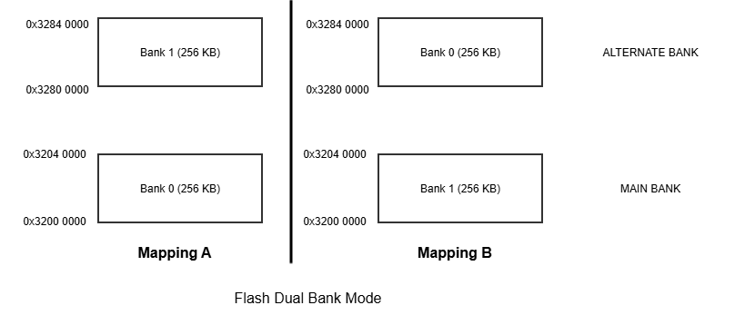
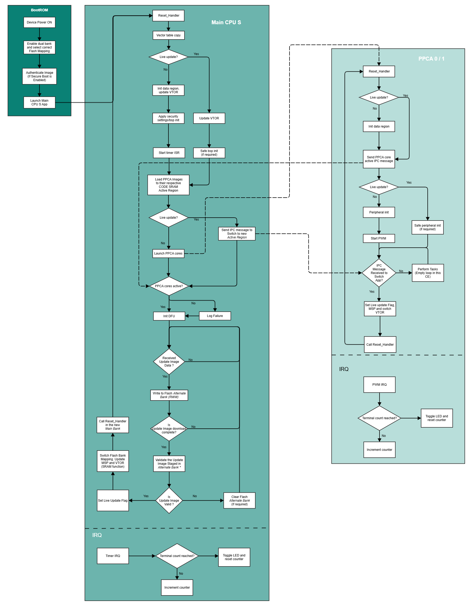
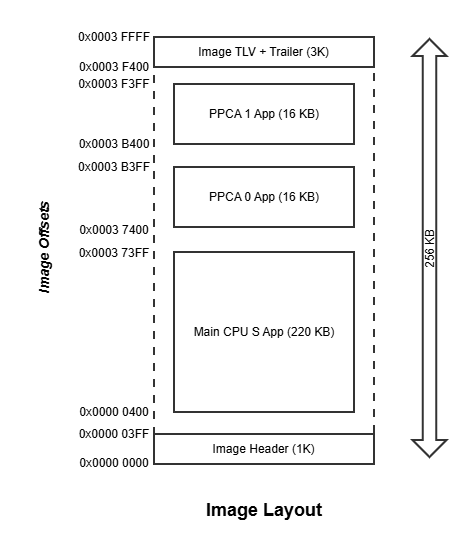

[Click here](../README.md) to view the README.

## Design and implementation

This code example uses a three-project structure to develop code for the main CM33, PPCA0, and PPCA1 cores. Although TrustZone is enabled in main CM33 core, this example uses only the secure processing environment (SPE). The three project folders are:

**Table 1. Application projects**

Project       | Description
-------       | -----------------------
*main_cm33_s* | Project for main CM33 SPE
*ppca_cm33_0* | Project for PPCA CM330 non-secure processing environment (NSPE)
*ppca_cm33_1* | Project for PPCA CM331 NSPE

 

The main CM33 core acts as the secure orchestrator and applies the required device security. It loads the PPCA core images to their respective CODE SRAM and enables them according to the situation, see [Live firmware Update Flow](#live-firmware-update-flow). It also hosts the DFU MW to download the update image and stages it in the alternate bank, and validates and triggers the live firmware update process.

On bootup, each PPCA core sends a "core up" notification to the main CM33 core over a dedicated IPC notify mailbox channel (see [Inter-core synchronization](#inter-core-synchronization)) and then starts toggling its user LED from a PWM interrupt at the rate of 1000 ms. The PWM waveorm can be verified on pin P8.0 and pin P8.2. The PPCA core then idles in a wait loop and switches to the new app when it receives an app-switch request from the main CM33 core. If a PPCA core cannot switch to the new app (the staged image fails a basic vector-table sanity check), it enters a repeating double-pulse LED failure pattern.

### Resources and settings

The application uses UART to print messages on the UART terminal. The UART resource initialization and retargeting of the standard I/O to the UART port is performed using the [retarget-io](https://github.com/Infineon/retarget-io) library.
The application uses PMBus (I2C) to receive the update image to perform the live firmware update. The I2C port is managed by the [DFU](https://github.com/Infineon/dfu) middleware.

**Table 2. Application resources**

Resource    |  Alias/object      |    Purpose
:---------- | :------------------| :------------
 UART (HAL) | DEBUG_UART_hal_obj | UART HAL object for debug UART
 PMBus/I2C  (HAL) | dfuI2cHalObj       | I2C HAL object used for DFU transport
 GPIO (PDL) | CYBSP_USER_LED2    | User LED from PPCA Core 0 (for EVK kit)
 GPIO (PDL) | CYBSP_USER_LED6    | User LED from PPCA Core 1 (for EVK kit)
 GPIO (PDL) | CYBSP_USER_LED3    | User LED from main core
 IPC  (PDL) | PPCA_IPC_STRUCT0/1 | IPC notify mailbox channels for PPCA Core 0/1 -> main core ("core up" status)
 IPC  (PDL) | PPCA_IPC_STRUCT2/3 | IPC notify mailbox channels for main core -> PPCA Core 0/1 (app-switch request)
 TCPWM (PDL)| MAIN_TC            | Main core periodic timer that drives the main-core LED heartbeat
 TCPWM (PDL)| PPCA0_PWM / PPCA1_PWM | PWM timers that drive the PPCA Core 0 / Core 1 LED blink

### Main core heartbeat timer

The main CM33 core runs a free-running periodic timer (a TCPWM counter, referenced as `MAIN_TC`) that produces a visible "heartbeat" on the main-core user LED. This LED activity is what lets you confirm at a glance that the main core stayed alive throughout the live firmware update.

The counter is configured in continuous up-counting mode with the period register set to 9999 (10000 counts per cycle) and an interrupt on terminal count. The interrupt handler (`Main_Timer_Handler`) increments a software counter on every terminal-count interrupt and, once it reaches 10000 interrupts, clears the counter and toggles the main-core user LED. This software divide produces the periodic LED toggle (approximately 1 s, as reported in the README).

The important point for live firmware update is how this timer behaves across the switch:

- The software counter (`main_timer_count`) is kept in the [persistent state](#persistent-state-retention), so the LED phase is retained across the switch.
- On a **cold boot** the timer is initialized, enabled, its NVIC priority is set, and the counter is started.
- On a **live update boot** the timer and its NVIC line are deliberately **not** re-initialized: the counter keeps running across the soft app switch, and the new image simply continues servicing the terminal-count interrupt through its own vector table. The result is an uninterrupted LED heartbeat with no visible glitch, which demonstrates that a peripheral and its interrupt can keep operating seamlessly while the application image is replaced.

### PPCA core PWM and LED blink

Each PPCA core drives its user LED from a PWM peripheral (`PPCA0_PWM` on Core 0 and `PPCA1_PWM` on Core 1) instead of a CPU loop, so the blink rate is independent of what the core's main loop is doing. The PWM is configured to raise an interrupt on its compare event, and the handler (`PPCA0_PWM_Handler` / `PPCA1_PWM_Handler`) clears the interrupt and increments a software counter; once the counter reaches its threshold it is cleared and the user LED is toggled. The net LED period is build dependent (500 ms for even builds, 250 ms for odd builds) so that you can visually confirm a successful PPCA switch by the change in blink rate.

The PWM data is preserved across the live update in the same way as the main heartbeat timer:

- The PWM/blink software counter (`pwm_count`) lives in each PPCA core's [persistent state](#persistent-state-retention), so the blink phase is retained across the switch.
- On a **cold boot** the PWM is initialized, enabled, its NVIC priority is set, and the timer is started.
- On a **live update boot** the PWM and its NVIC line are **not** re-initialized. The PWM keeps counting across the switch, and the new PPCA image continues servicing the compare interrupt through its own (code-SRAM) vector table, so the LED keeps blinking without a visible glitch.

### Live vector table and switch disruption

The central trick that makes the no-reset switch possible is that **every image is built with a complete, real vector table** that already contains the addresses of that image's actual interrupt service routines. There is no dummy or placeholder table and no run-time patching of individual vectors. As a result, switching to a new image is as simple as repointing the Arm `VTOR` (Vector Table Offset Register) at the new image's vector table: from the very next interrupt onward, the CPU dispatches directly to the new image's real handlers.

The two core families differ only in where the new vector table lives:

- **Main CM33 core** executes in place from flash, so `switch_app()` first points `VTOR` at the new image's flash vector table, performs the bank-mapping swap, and jumps to the new `Reset_Handler`. The new `Reset_Handler` then copies the flash vector table into SRAM and moves `VTOR` from flash to SRAM. Only the two short critical sections, one in `switch_app()` and one for the Flash-to-RAM `VTOR` change in `Reset_Handler`, run with interrupts disabled.
- **PPCA cores** execute from code SRAM, so their `switch_app()` simply points `VTOR` at the new image's code-SRAM vector table; there is no flash bank swap and no subsequent Flash-to-RAM copy.

Because the rest of the switch keeps interrupts enabled and the peripherals running, the only window in which interrupts are blocked is these few instructions. The measured total disruption (the combined interrupts-disabled time across the switch) is:

**Table 4. Switch disruption (interrupts disabled)**

Core | Cycles | Time @ 180 MHz
:--- | :----- | :-------------
 Main CM33 | ~135 (in `switch_app()` + Flash-to-RAM `VTOR` change in `Reset_Handler`) | ~0.75 &micro;s
 PPCA      | ~13 (single `VTOR` change in `switch_app()`) | ~0.072 &micro;s (~72 ns)

 

During these short windows no interrupt is lost; pending interrupts are simply held until interrupts are re-enabled a few cycles later, after `VTOR` already points at the new image. This is why the LED heartbeat and the PPCA blink continue with no perceptible interruption across the live update.

### Dual-bank feature

The flash available in the PSOC&trade; Control C3M8 MCU offers the dual-bank operation mode. The flash is made up of two banks (here referred to as Bank 0 and Bank 1) of equal size. When in single bank mode, both the banks are mapped continuously in the address space (0x32000000 - 0x32080000) and appear as a single flash to users. In dual-bank mode, both the banks are mapped to a non-contiguous address range, 0x3200_0000-0x3204_0000 and 0x3280_0000-0x3284_0000. Two mapping modes are available to users, A and B. In mode A, Bank 0 is mapped to the lower address range and Bank 1 is mapped to the upper address range while in mode B, Bank 1 is mapped to the lower address range and Bank 0 is mapped to upper address range. The bank in the lower address is referred to as the main bank and only the code present in this bank is executed. The bank at the upper address range is referred to as the alternate bank, and it is used for staging the new FW.

   **Figure 1. Dual-bank mapping**

   

### BootROM with dual-bank

During bootup, the BootROM enables the dual-bank feature if configured and looks for a counter value (at a fixed offset) in both the banks and compares the counter values. The BootROM then selects a mapping mode (A or B) so the bank with the higher counter value is mapped to the main bank (lower address range). After the bank mapping is decided, it boots the application from the main bank. It is the customer's responsibility to manage the dual-bank counter value when generating new firmware for update.

Enabling the dual-bank feature and setting the dual-bank counter offset is done by provisioning the device with the OEM policy. See Step 3 of the [Operation](../README.md/#operation) section of the README for provisioning.

### Live firmware Update Flow

Main CM33 Application is executed directly from flash Main Bank, live firmware update of this core can be achieved by leveraging the dual-bank feature of the flash. But PPCA cores are executed from their respective CODE SRAM and it does not support dual-bank feature. To achieve live firmware update of PPCA core their respective CODE SRAM is split into two equal parts, one half shall be used for code execution (Active Region) while the other half will be used for staging (Shadow Region) the new image.

After Downloading and verifying the new firmware package in Alternate Bank, Main CM33 core performs the bank mode swapping. This results in swapping of Bank 0 and Bank 1 position , i.e. Alternate Bank becomes the new Main Bank. Jumps to Reset handler of Main CPU S application in the new Main Bank. Now, the New Main CM33 core image takes over and checks if the PPCA cores are running from previous boot. If yes, sends switch requests to PPCA cores.

On receiving the switch request from Main CM33 core, PPCA cores jumps to Reset handler of the new app present in the Shadow Region(New Active Region). Now, the New PPCA image takes over.

   **Figure 2. Flow Chart**

   

### Boot flow: cold boot vs live update boot

Because the live firmware update does not reset the device, the new image runs through its normal reset and startup code, but it must take a different path than a power-on boot. The application distinguishes the two cases using the persistent live-update state (a start magic, a `live_update` flag, and an end magic). The shared startup code (`Cy_LFU_IsLiveBoot()` in `startup_cat1b_cm33.c`) reads these words at known offsets before any C runtime initialization, and the application re-checks the same flag in `main()` (`is_live_update()`).

**Cold boot (power-on or hardware reset)**

1. The BootROM selects the flash bank with the higher dual-bank counter and starts the main image from the main bank.
2. The main core `Reset_Handler` finds the persistent magics unset, so it runs the full startup: enable I-cache and FPU, copy the flash vector table into SRAM and point `VTOR` at it, set the stack limit, and call `SystemInit()` to configure clocks. The C runtime then initializes `.data`/`.bss`.
3. `main()` sees a cold boot and performs full initialization: it sets the persistent state to its defaults, runs the complete board init (`cybsp_init()`), enables interrupts, initializes retarget-io, prints the banner and image version, and configures, enables, and starts the [main heartbeat timer](#main-core-heartbeat-timer).
4. It then enables the IPC receive interrupts and calls `PPCA_Init()`, which enables the PPCA code SRAM, copies both PPCA images into their active regions, starts both cores, and waits for each to report "core up".
5. Finally it initializes the DFU middleware and PMBus transport and enters the DFU service loop, ready to receive an update image.

**Live update boot (after the bank swap, no device reset)**

1. The main core's `switch_app()` sets the `live_update` flag in the persistent state, toggles the flash bank mapping (making the staged image the active bank), invalidates the instruction cache, points `VTOR` at the new image's flash vector table, sets the stack pointer, and jumps to the new image's `Reset_Handler` with interrupts still enabled.
2. The new image's `Reset_Handler` detects a live boot and takes a fast path: it skips the cache, FPU, and clock (`SystemInit()`) re-initialization because those resources are already configured and kept running. It only repopulates the SRAM vector table and switches `VTOR` from flash to SRAM inside a very small interrupts-disabled window, so peripherals and their interrupts keep being serviced throughout. The C runtime still runs to re-initialize `.data`/`.bss`, but the persistent state lives in a no-init section that is left untouched.
3. `main()` sees a live update boot and skips the disruptive re-initialization: it does not re-run the full board init (only a placeholder `safe_bsp_init()` is called), it does not re-initialize or restart the heartbeat timer, and it prints the "Live Update: Booting New Image" banner. The running peripherals and their persistent counts are preserved.
4. It enables the IPC receive interrupts and calls `PPCA_Init()`, which this time copies the new PPCA images into the shadow regions, marks each core as "update requested", sends a switch request to each running PPCA core, and waits for each core to restart on the new image and report "core up" again.
5. It re-initializes the DFU middleware and transport so the device is immediately ready to accept the next update.

### Inter-core synchronization

The main CM33 core and the two PPCA cores coordinate over an IPC notify-interrupt mailbox. Four unidirectional channels are used so that there is no lock contention and the notify interrupt always routes to a deterministic NVIC line on the receiving core:

**Table 3. IPC mailbox channels**

Channel | Direction      | Purpose
:------- | :------------- | :------------
 0      | PPCA Core 0 -> main | PPCA Core 0 reports "core up"
 1      | PPCA Core 1 -> main | PPCA Core 1 reports "core up"
 2      | main -> PPCA Core 0 | Request PPCA Core 0 to switch to the new image
 3      | main -> PPCA Core 1 | Request PPCA Core 1 to switch to the new image

 

Each message is a single word. A PPCA core sends a "core up" message as soon as it is running, and the main core sends a "switch request" message when a new image has been staged. Because the mailbox is interrupt driven, the PPCA cores do not busy-poll the IPC channel, so their interrupts remain serviceable for nearly the entire run time.

The main core tracks the run state of each PPCA core (off, running, update requested) in its persistent state, updating it from the IPC receive handlers. On a cold boot, it starts both cores and waits for each "core up" message, setting the state to *running*. On a live update boot, it stages the new images, sets each core to *update requested*, sends a switch request, and waits for each core to restart on the new image and report "core up" again, which returns the state to *running*. The run state is what lets the new main image know, after a switch, which PPCA cores were already running and therefore need a switch request.

### Persistent state retention

The live firmware update switches from the old image to the new image without a device reset, so a small amount of run-time state must survive the switch. Each application places its state structure in a dedicated no-init memory region (`.cy_live_persistent_data`) that is neither programmed into the image nor zeroed at startup. The region is marked `UNINIT`/`NOLOAD` in the linker scripts of all three supported toolchains, and the state structure is the first object placed in the region so its address is stable across builds.

Each state structure is guarded by a start and an end magic word. On a cold boot, the magic words do not match and the application initializes the state to its defaults. On a live update boot, the magic words match and the `live_update` flag is set, so the application skips re-initialization and continues with the retained state. The main CM33 core uses this mechanism to remember the run state of both PPCA cores (so that, after the switch, it knows which cores were already running and need an app-switch request), while each PPCA core uses it to retain its blink/PWM count across the switch.

### Update image validation

Before the main core triggers the switch, it validates the staged image in the alternate bank (`validate_image()`). The update is accepted only when all of the following hold:

- The staged image header magic and version magic match the expected values.
- The new build number is strictly greater than the currently running build number, so the device never "updates" to an older or identical image.
- The new build number has the opposite parity (odd vs even) to the current one. This is required because the PPCA images are generated for one of two code-SRAM slots depending on build parity (see [Image Layout and Update Image](#image-layout-and-update-image)); alternating parity guarantees the new PPCA image lands in the shadow region rather than overwriting the running one.
- The staged vector table looks sane: a non-zero initial stack pointer, a non-zero reset vector, and the reset vector's Thumb bit set.

If any check fails, the main core does not switch. Instead it invalidates the staged image (a non-blocking erase of the staging-bank header row) and restarts the DFU transport so a fresh image can be downloaded.

### Image Layout and Update Image

Below figure shows the Image layout which consists all three applications. Image will be following MCU Boot format. Build Number (32-bit value) present in the Image Header at offset 0x00000018 will be configured as dual bank counter in the provisioning for deciding the flash bank mapping by the Bootloader.

   **Figure 3. Image Layout**

   

To achieve the live firmwatre update of PPCA cores it is essential to generate the PPCA images for different address in every alternate build. In this code example, for every even build PPCA code is generated for address space *0x0000 0000 - 0x0000 3FFF* and for every odd build it is generated for address space *0x0000 4000 - 0x0000 7FFF*. This information is added to the Main CM33 core application as it is required to load the PPCA images to proper address space.

For a detailed description of the build pipeline, pre-build and post-build steps, PPCA linker slot selection, and the Signer-Combiner image assembly, see [Build infrastructure](build_infrastructure.md).